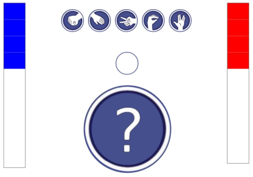
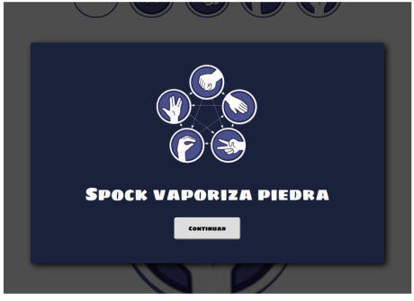

Acabamos de incorporarnos como desarrolladores junior en una multinacional dedicada al Software. Como primer proyecto, nos han adjudicado un programa que un extrabajador, que se fue por patas, ha dejado a mitad.

El programa en cuestión es unjuego online basado en el clásico juego "piedra, papel, tijera, lagarto, Spock" que todos hemos visto en la aclamada serie Big Bang Theory.



- Utilizando Javascript, crear los elementos HTML necesarios, junto con los ID, eventsListeners y demás atributos que necesitemos para el correcto funcionamiento de la aplicación. Para acceder a un campo custom HTML, como por ejemplo el data-puntos=”3” que vemos en la imagen, lo haremos como indica después del código.

```html
<div class="contitem">
   <div class="item">
      
      <h3>TIJERA</h3>
   </div>
</div>

elemento.dataset.puntos
```

- Conseguir el mecanismo drag and drop con los items. Estos tendrán que ir desde su posición inicial hasta la casilla de juego. En su defecto, pero penalizando 1.5 puntos, podemos utilizar otros eventos como el doble click.

Debemos tener en cuenta una serie de cosas.

1. Partimos con una estructura de datos a la cual accederemos de la siguiente forma:

```html
mensajes.pisp
mensajes[“pisp”]
```

En ella podemos encontrar los mensajes fruto de la deliberación de la máquina, esto es, por ejemplo, si nosotros sacamos piedra, y la máquina Spock, la máquina sumaría un total de 5 puntos en forma de cuadraditos rojos que se mostrarían de arriba a abajo en la columna correspondiente a la máquina, y mostraría el mensaje:



El modo de juego es simple, si ganamos con un Item en concreto, la puntuación indicada en la matriz indicada, se transforma en el mismo número de cuadraditos en el indicador correspondiente, el de la
izquierda si ganamos nosotros (azul), el de la derecha si gana la máquina (rojo).

El primero de los dos que llegue a los 10 puntos acumulados, gana la partida y esta se vuelve a reiniciar poniendo el tablero de juego a 0.

Ánimo!!